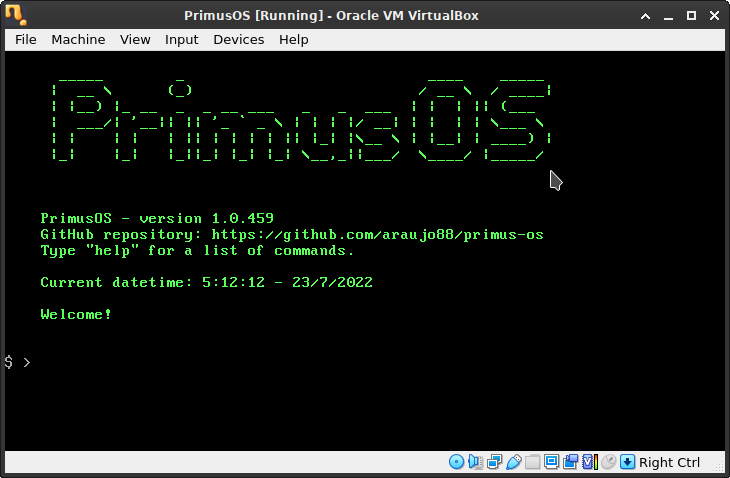

# PrimusOS

A simple bare-bones 32-bit Ring 0 operating system written in Assembly x86 and C for educational purposes.  
Inspired by Terry A. Davis (in memoriam).

## Dependencies for building

`xorriso`  
`mtools`  

## Bootloader "hello world" example

### Compile bootloader

`nasm -o bootloader.bin bootloader.asm`

### Testing with QEmu

`qemu-system-x86_64 bootloader.bin`

## Compiling the kernel example

`gcc -c kernel.c -o kernel -ffreestanding -m32`

## Generating the ISO image

`make clean`  
`make primus-os.iso`

## About pull requests

PLEASE, comment on the related issue BEFORE sending a pull request! Thanks. Contributions and improvements are always welcome.

## TODO

- Implement unit tests and bechmarks (math functions)  
- Implement memory management  
- Add file system and disk partitioning  
- Add multithreading  
- Implement calculator (parsing of command-line tokens)  
- Implement basic text editor  
- Create documentation  
- Add games (tic-tac-toe, chess, etc.)  
- Implement other VGA graphic modes  
- Implement complex number library in C++  
- Implement linear algebra library, scientific computing, etc.  
